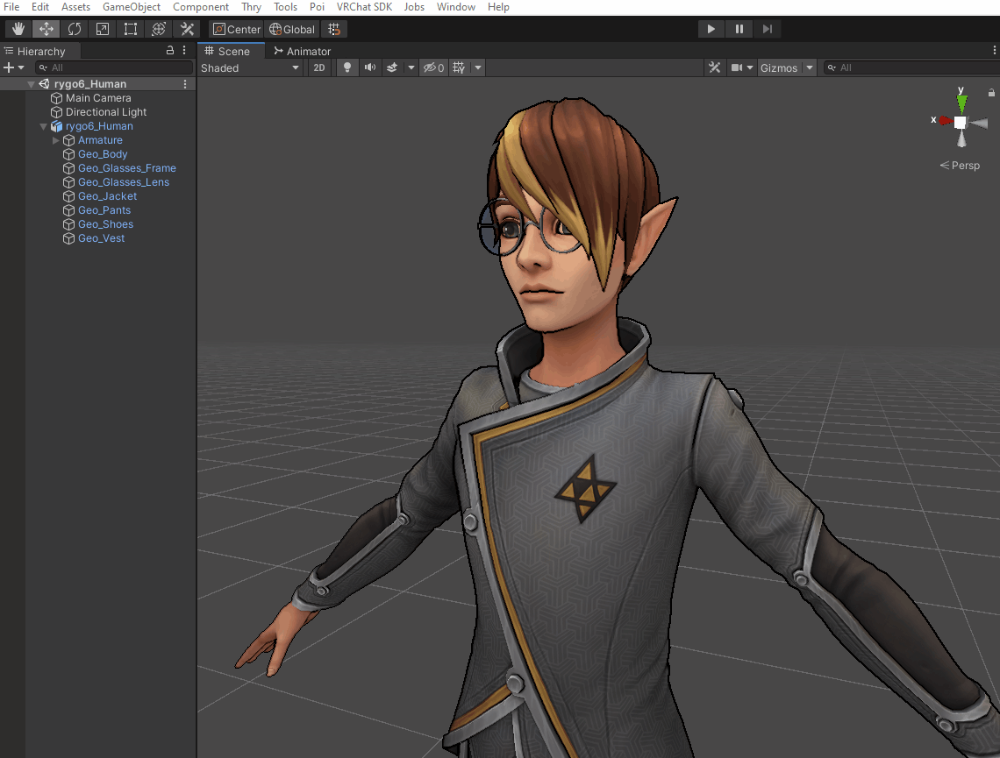

The official root repository for this project is here https://github.com/rygo6/GTAvaUtil.

# GeoTetra AvaUtil

This is essentially a throw bag of utilities for VRChat avatars that I either do not see existing elsewhere, or the other freely available options do it incorrectly.

Join the GeoTetra Discord for support or suggestions about more avatar utilities to be added: https://discord.gg/nbzqtaVP9J

## Installation

1. Open the Unity Package Manager under `Window > Package Manager`.
2. Click the + in the upper left of package manager window.
3. Select 'Add package from git url...'.
4. Paste `https://github.com/rygo6/GTAvaUtil.git` into the dialogue and click 'Add'.

## Usage

All utilities are currently under the `Tools > GeoTetra > GTAvaUtil` menu at the top of the Unity Editor. Currently there are only a handful of utility methods.

### Bake Vertex AO On Combined MeshRenders+MeshFilters and Apply to Vertex Color...

This will let you bake down Ambient Occlusion on an entire avatar to the vertex colors. This applies certain smoothing parameters as well to give you a very smooth, averaged, ambient occlusion effect. Generally find it superior to what you would get from Ambient Occlusion texture baking in blender, which can be too precise and look odd on avatars with so many moving parts.

1. I would suggest posing your avatar into an A pose with its legs spread so the AO shades the under arms and in between the legs better. I would also fully activate the 'aa' blendshape so the mouth is open and AO get inside the mouth.
2. Select all the SkinnedMeshRenderers and MeshFilters you wish to bake AO onto. It is necessary to select them all and bake them all at once so they occlude each other. Objects not in the selection will not contribute to the occlusion.
3. Click `Tools > GeoTetra > GTAvaUtil > Bake Vertex AO On Combined MeshRenders+MeshFilters and Apply to Vertex Color...`.
4. Wait for baking to finish. It applies the baked colors to the vertex colors of the mesh, saves a new mesh for each, and applies those back to the original SkinnedMeshRenderers and MeshFilters.

You can selectively run `Average Vertex Colors On SkinnedMeshRenders or MeshFilters...` on specific meshes to smooth things out further.

### Average Vertex Colors On SkinnedMeshRenders or MeshFilters...

This averages the vertex colors on selected Meshfilters or skinnedMeshRenderers, saves it to a new mesh and applies it back to the renderer.

1. Select the MeshFilters or SkinnedMeshRenderers you want to average the vertex colors on.
2. Click `Tools > GeoTetra > GTAvaUtil > Average Vertex Colors On MeshFilter...`.
3. Vertex colors should appear smoothed in about a second.

### Transfer SkinnedMeshRenderer Bones To Another SkinnedMeshRenderer...

 This will let you attach a rigged clothing item to the skeleton of your avatar.

There are other utilities that do this but I found they did it incorrectly. You would end up with a duplicated skeleton for each clothing item or it messed up when the bones weren't in the same exact position.

This utility will attach the clothing item to the actual skeleton of the avatar itself, so then all your clothing items will use the same skeleton and GameObjects that the avatar itself uses. 

It also calculates new bindposes in case your avatars bones and your clothing items bones are not in the exact same position.

For this to work your clothing items skeleton and your avatars skeleton must have the same hierarchy and naming. It is not necessary that the skeletons exactly match, but every bone present in your clothing items skeleton must also be present in your avatars skeleton. 

*Nearly every clothing package for a particular avatar I have bought off of gumroad has been set up like this, so I assume this should just work for most avatar clothing packages.*

1. First line up your clothing item to your avatar. 
2. Next, select the SkinnedMeshRender you want to transfer bone data from, this is probably your avatars SkinnedMeshRenderer.
3. Next hold down ctrl and select the SkinnedMeshRenderer you want to transfer the bone data onto, this is probably your clothing items SkinnedMeshRender.
4. Now click `Tools > GeoTetra > GTAvaUtil > Transfer SkinnedMeshRenderer Bones...`. If it completes without errors then it worked and should have made a new GameObject next to your avatars SkinnedMeshRenderer with your newly attached clothing item. If you rotate the leg or spine of your avatars skeleton, your clothing item should now be properly attached.

### Add Probe Anchor From Averaged Mesh Positions...

This will automatically place a light probe anchor at the average position between all selected meshes.

1. Select all the meshes of a single avatar.
2. Click `Tools > GeoTetra > GTAvaUtil > Add Probe Anchor From Averaged Mesh Positions...`.
3. This will make a 'ProbeAnchor' GameObject hooked up to all the meshes. You can better position this afterwards if you wish.

### Recalculate SkinnedMeshRenderer Bounds...

This will automatically recalculate the bounds of a selected set of SkinnedMeshRenderers.

1. Select any number of SkinnedMeshRenderers.
2. Click `Tools > GeoTetra > GTAvaUtil > Recalculate SkinnedMeshRenderer Bounds...`.

### Bake SkinnedMeshRenderer to MeshRenderer...

This will let you pose a SkinnedMeshRenderer, set its blendshapes and then bake it out to a static mesh. This I mainly use with the package Zologo VertexDirt to then bake down vertex ambient occlusion on a mesh after I tweaked its blendshapes and pose.

1. Pose your skeleton and adjust the blendshapes to what you want.
2. Then select any number of SkinnedMeshRender's and click `Tools > GeoTetra > GTAvaUtil > Bake SkinnedMeshRenderer...`.

### Transfer Mesh Colors...

This will let you transfer the vertex colors from a static mesh onto a SkinnedMeshRenderer. Mainly I use this to transfer baked vertex ambient occlusion onto my avatar.

1. Select the MeshFilter you want to transfer colors from.
2. Select the SkinnedMeshRenderer you want to transfer the colors to.
3. Click `Tools > GeoTetra > GTAvaUtil > Transfer Mesh Colors...`.